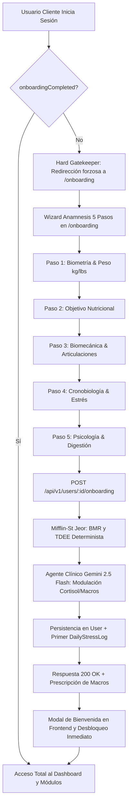

# Plan de Implementación: Anamnesis Integral, Gatekeeper y Agente Nutricional IA (Vital Fit)

Implementación del flujo integral de evaluación inicial del atleta (Anamnesis Integral), el mecanismo de bloqueo estricto (*Hard Gatekeeper*) que protege todas las rutas del aplicativo para clientes que no hayan completado su evaluación, y el motor de cálculo metabólico híbrido (**Mifflin-St Jeor** + Modulación Clínica con **Gemini AI**) con asignación de calorías y macronutrientes.

---

## ⚠️ Garantía de Seguridad en Base de Datos (Cero Pérdida de Datos)

> [!IMPORTANT]
> **Protección absoluta de datos existentes en Supabase PostgreSQL:**
> 1. Las modificaciones al modelo `User` son **estrictamente aditivas**: se agregan campos opcionales (`targetProtein Float?`, `targetCarbs Float?`, `targetFats Float?`, `weightUnitPreference String @default("kg")`, `gender String?`, `age Int?`, `anamnesisData Json?`).
> 2. **Ninguna tabla existente será borrada ni reiniciada** (`DROP TABLE`, `TRUNCATE` o `migrate reset` están estrictamente vetados).
> 3. Se inspeccionará el script SQL generado antes de su ejecución para comprobar que solo contenga sentencias no destructivas tipo `ALTER TABLE "users" ADD COLUMN ...`.
> 4. Se resolverá la duplicidad detectada entre `.env` y `prisma/.env` para evitar errores de ejecución en Prisma.

---

## Decisiones Técnicas y Arquitectura

---

## Cambios Propuestos

### Backend (`olympus-bite-bk`)

#### [MODIFY] [schema.prisma](file:///home/kali/Documentos/punto-de-acceso/olympus-bite-bk/prisma/schema.prisma)
- Añadir campos de macronutrientes objetivo y preferencias al modelo `User`:
  - `targetProtein Float? @map("target_protein")`
  - `targetCarbs Float? @map("target_carbs")`
  - `targetFats Float? @map("target_fats")`
  - `weightUnitPreference String @default("kg") @map("weight_unit_preference")`
  - `gender String? @map("gender")`
  - `age Int? @map("age")`
  - `anamnesisData Json? @map("anamnesis_data")` (para preservar todo el detalle de respuestas sin pérdida).
- Generar y aplicar la migración SQL aditiva de forma segura.

#### [MODIFY] [user.entity.ts](file:///home/kali/Documentos/punto-de-acceso/olympus-bite-bk/src/modules/users/domain/entities/user.entity.ts)
- Actualizar la entidad `User` para incluir los nuevos campos y enriquecer `completeOnboarding()`.

#### [MODIFY] [prisma-user.repository.ts](file:///home/kali/Documentos/punto-de-acceso/olympus-bite-bk/src/modules/users/infrastructure/adapters/persistence/prisma-user.repository.ts)
- Mapear los nuevos campos en `toDomain()`, `save()` y `update()`.

#### [NEW] [onboarding-submission.dto.ts](file:///home/kali/Documentos/punto-de-acceso/olympus-bite-bk/src/modules/users/application/dtos/onboarding-submission.dto.ts)
- DTO validado con `class-validator` para los 5 pasos de anamnesis (sexo, edad, peso, estatura, unidad de peso, objetivo, experiencia, lesiones articulares, NEAT, sueño, estrés, ansiedad, salud digestiva, frecuencia de comidas).

#### [NEW] [process-onboarding.use-case.ts](file:///home/kali/Documentos/punto-de-acceso/olympus-bite-bk/src/modules/users/application/use-cases/process-onboarding.use-case.ts)
- Implementar el motor de cálculo:
  1. Normalización canónica de peso (`lbs` a `kg` si aplica).
  2. Fórmula Mifflin-St Jeor exacta para BMR según género.
  3. Multiplicador de actividad (NEAT) para TDEE base.
  4. Modulación con Gemini 2.5 Flash: prompt clínico con variables de cortisol/estrés, sueño, digestión y objetivos para calcular ajuste calórico, macros (proteína, carbohidratos, grasas) y justificación personalizada.
  5. Fallback determinista científico en caso de contingencia con la API de IA para garantizar disponibilidad del 100%.
  6. Actualización en base de datos de `User` y creación del primer registro en `DailyStressLog`.

#### [MODIFY] [user-response.dto.ts](file:///home/kali/Documentos/punto-de-acceso/olympus-bite-bk/src/modules/users/application/dtos/user-response.dto.ts)
- Incluir `targetProtein`, `targetCarbs`, `targetFats`, `weightUnitPreference`, `gender`, `age` en el DTO de respuesta.

#### [MODIFY] [users.controller.ts](file:///home/kali/Documentos/punto-de-acceso/olympus-bite-bk/src/modules/users/infrastructure/adapters/http/users.controller.ts)
- Añadir el endpoint `POST :id/onboarding` para procesar la anamnesis completa.
- Mantener retrocompatibilidad con `PUT :id/onboarding`.

#### [MODIFY] [users.module.ts](file:///home/kali/Documentos/punto-de-acceso/olympus-bite-bk/src/modules/users/infrastructure/users.module.ts)
- Registrar `ProcessOnboardingUseCase` como proveedor.

---

### Frontend (`olympus-bite-ft`)

#### [MODIFY] [common.types.ts](file:///home/kali/Documentos/punto-de-acceso/olympus-bite-ft/shared/types/common.types.ts)
- Actualizar la interfaz `User` con `targetProtein`, `targetCarbs`, `targetFats`, `weightUnitPreference`, `gender`, `age`.

#### [MODIFY] [useAuth.tsx](file:///home/kali/Documentos/punto-de-acceso/olympus-bite-ft/features/auth/hooks/useAuth.tsx)
- Agregar método `updateUser(updatedUser: Partial<User>)` al contexto para actualizar reactivamente los datos del usuario en memoria y en `localStorage` sin requerir recargar la página.

#### [MODIFY] [clients.service.ts](file:///home/kali/Documentos/punto-de-acceso/olympus-bite-ft/features/clients/services/clients.service.ts)
- Agregar `submitOnboarding(id: string, data: OnboardingSubmissionDto)` apuntando a `POST /users/${id}/onboarding`.

#### [MODIFY] [layout.tsx](file:///home/kali/Documentos/punto-de-acceso/olympus-bite-ft/app/(app)/layout.tsx)
- **Hard Gatekeeper:**
  - Si el usuario autenticado tiene rol `client` y `!user.onboardingCompleted`, redirigir automáticamente a `/onboarding` y bloquear el renderizado de cualquier otra vista protegida.
  - Si ya completó el onboarding e intenta ingresar a `/onboarding`, redirigir a `/dashboard`.
- **Aislamiento visual estricto:**
  - Cuando la ruta sea `/onboarding`, ocultar completamente `Sidebar`, `MobileNav`, `SettingsTrigger`, `GlobalAiAssistant`, `NotificationPrompt` y el antiguo modal flotante, entregando un lienzo limpio y enfocado.

#### [MODIFY] [page.tsx](file:///home/kali/Documentos/punto-de-acceso/olympus-bite-ft/app/(app)/onboarding/page.tsx)
- Reconstrucción total con arquitectura de micro-pantallas (*one intent per screen*) y transiciones fluidas con `framer-motion`:
  - **Header fijo:** Botón de retroceso `<`, barra de progreso animada superior y botón de escape seguro para entrenadores en modo atleta (*"Salir a Modo Entrenador"*).
  - **Micro-pantallas:**
    1. *Nombre:* Input táctil con botón de borrado `(×)` y banner de perfil.
    2. *Propósito:* Cuadrícula 2 columnas de propósitos con iconos (Grasa, Músculo, Longevidad, Digestión, Rendimiento).
    3. *Sexo biológico:* Tarjetas Hombre / Mujer con auto-avance.
    4. *Fecha de nacimiento / Edad:* Drum/Wheel picker (Día, Mes, Año) con franja horizontal translúcida y cálculo automático de edad.
    5. *Estatura:* Hero number grande en `cm` con control táctil.
    6. *Peso actual:* Hero number grande con toggle `[ kg | lbs ]`.
    7. *Grasa corporal:* Cuadrícula 3 columnas de siluetas anatómicas circulares (<8%, 9-14%, 15-19%, etc.) + botón *"Ingresar porcentaje exacto"*.
    8. *Peso objetivo:* Hero number + Slider interactivo con badge dinámica (*Recomposición*, *Déficit moderado*, *Pérdida considerable*, *Ganancia muscular*) + botón *"No sé mi peso objetivo"*.
    9. *Comportamiento del peso:* Estable, Fluctuante, Aumentando, Disminuyendo.
    10. *Tipo de actividad:* Cardio, Fuerza, Ninguna (exclusiva).
    11. *Frecuencia de fuerza:* Selector vertical de 1 a 7 días.
    12. *Duración promedio:* Hero number `90 min` + Slider horizontal con marcas.
    13. *Preferencias alimentarias:* Nube de cápsulas con emojis (Vegano, Vegetariano, Bajo en azúcar, etc.) + `+ Escribir otra opción`.
    14. *Alergias e intolerancias:* Nube de cápsulas con selección activa azul vibrante y contador de memorias.
    15. *Hábitos y estilo de vida:* Nube de 18+ hábitos (Como fuera, Antojos dulces, Poca agua, etc.).
    16. *Memorias libres:* Modal/Sheet con campo libre para notas clínicas del atleta.
    17. *Ayuno intermitente:* Tarjetas con radios (No, 12:12, 14:10, 16:8, 18:6, 20:4, OMAD).
    18. *Suplementos:* Pregunta binaria + Mockup de teléfono con biblioteca de suplementos.
    19. *País de residencia:* Buscador `🔍 Buscar país` + Lista de más frecuentes con banderas.
    20. *Calorías recomendadas:* Hero stepper `[-] 2874 kcal [+]` + Aviso de entrenador + Modal de evidencia científica + Modal de advertencia de ajuste manual.
    21. *Distribución de macronutrientes:* 3 anillos de progreso circular (Proteínas, Grasas, Carbohidratos) + Presets (Balanceada, Mediterránea, Baja en grasas, Keto) + Ajuste manual con 20 puntos discretos (`●●●○○○`) + Modal "Modificar valores" (`[ Gramos | Porcentaje ]`).
    22. *Mentalidad:* Pantalla "Hora de romper la racha" (Consistencia vs Perfección).
    23. *Notificaciones:* Mockup de notificación push simulada.
    24. *Animación de Embudo / Absorción:* Tarjetas flotantes orbitando que convergen y son absorbidas hacia el icono del Documento del Plan central (*"Todo listo. Vamos a crear tu plan personalizado"*).
    25. *Cálculo IA en tiempo real:* Secuencia de 5 iconos clínicos (🎯, ❤️, 📋, 🎛️, 🪄) con mensajes en vivo de Mifflin-St Jeor y cortisol.
    26. *Resumen Final de Entrega del Plan:* "¡Tu plan ya está listo!" con metas de nutrición (badges de colores), metas de actividad (pasos, cardio, fuerza), acordeón interactivo de objetivos y botón directo de ingreso a la plataforma.

---

## Plan de Verificación

### 1. Verificación del Backend y Base de Datos (Completado y Seguro)
- `schema.prisma` actualizado y sincronizado de forma segura vía `npx prisma db push` sin pérdida de datos.
- `OnboardingSubmissionDto` actualizado con campos opcionales del nuevo flujo.
- `ProcessOnboardingUseCase` calcula BMR, TDEE, modulación por cortisol y fallback determinista.

### 2. Verificación del Frontend
- Compilación de TypeScript: `npx tsc --noEmit` en `olympus-bite-ft`.
- Navegación fluida a través de las micro-pantallas:
  - Botón de retroceso `<` funcional en cada pantalla.
  - Barra de progreso superior que avanza reactivamente.
  - Hero inputs y sliders con actualización instantánea de estado.
  - Validación paso a paso antes de permitir avanzar.
  - Animación de convergencia de tarjetas hacia el documento del plan.
  - Envío final al backend y recepción de la prescripción personalizada de calorías y macros.
  - Verificación del botón de escape para entrenadores en modo atleta.
- Redirección automática y desbloqueo del Gatekeeper al finalizar el proceso.
